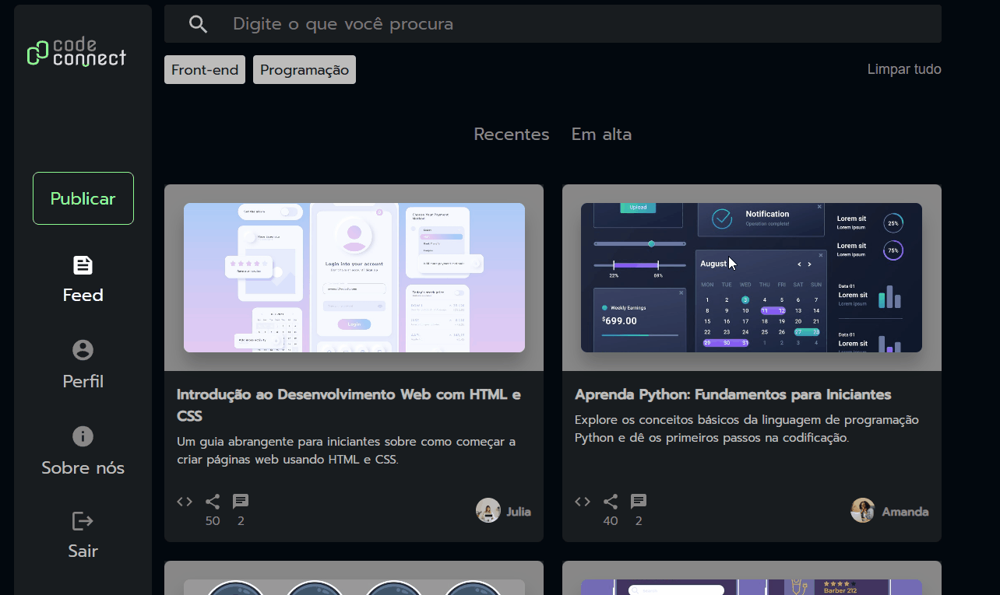

# CodeConnect

O CodeConnect é uma aplicação web **ilustrativa** que exibe uma lista de publicações de desenvolvedores. O projeto foi desenvolvido com **React + Vite**, com foco na **componentização e organização de código**.

## 🚀 Tecnologias Utilizadas
- **React** – Criação de componentes reutilizáveis.  
- **Vite** – Ferramenta de build rápida e simples.  
- **CSS** – Estilização personalizada.

## 📌 Funcionalidades
- Exibição de publicações em formato de cards.  
- Cada card mostra título, resumo, imagem de capa e autor.  
- Componentes reutilizáveis implementados para:  
  - Barra de pesquisa  
  - Filtros  
  - Ordenação  
  - Sidebar  
  - Card  

> **Observação:** A aplicação é ilustrativa; funcionalidades como consumo de dados, compartilhamentos e comentários **não estão implementadas**.

## 🖼️ Demonstração

  

🔗 [Clique aqui para ver no GitHub Pages](https://yasmim123456.github.io/codeconnect-feed/)
