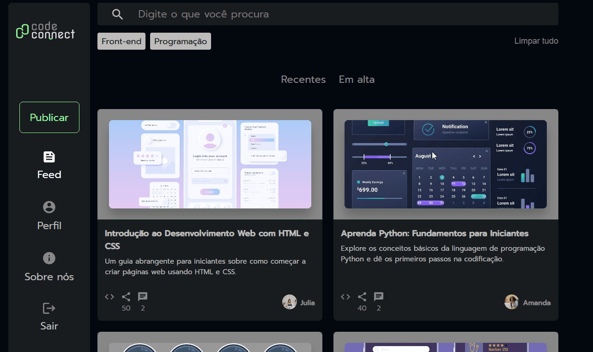

# CodeConnect

O **CodeConnect** é uma aplicação web que exibe uma lista de publicações de desenvolvedores. 
O projeto foi desenvolvido com **React + Vite**, consumindo dados de uma **API fake** hospedada no [My JSON Server](https://my-json-server.typicode.com/MonicaHillman/codeconnect-api/publicacoes).

## 🚀 Tecnologias Utilizadas

- **React** - Criação de componentes reutilizáveis e gerenciamento de estado.
- **Vite** - Ambiente de desenvolvimento rápido e otimizado.
- **JavaScript (ES6+)** - Lógica da aplicação.
- **Fetch API** - Consumo de dados externos.
- **CSS** - Estilização da interface.

## 📌 Funcionalidades

- Listagem de publicações em formato de cards.
- Consumo de dados de uma API externa.
- Filtro dinâmico de publicações por tags, com atualização em tempo real da lista de cards.
- Adição e remoção de filtros individualmente.
- Opção de limpar todos os filtros ativos.
- Exibição de:
  - título 
  - resumo 
  - imagem de capa
  - autor
  - indicadores visuais de código, compartilhamentos e comentários (apenas ilustrativos).
- Componentização da interface, incluindo:
  - Barra de pesquisa  
  - Filtros  
  - Ordenação  
  - Sidebar  
  - Card de publicação

  
---

## 🧠 Aprendizados

- Uso de `useState` e `useEffect`.
- Renderização condicional e listas com `map`.
- Filtragem de dados com base em propriedades da API.
- Normalização de dados para comparação de filtros.
- Organização e reutilização de componentes React.

---

## ℹ️ Observação

O projeto foi iniciado a partir de um curso de React, porém funcionalidades como a lógica de filtros, remoção individual, limpeza de filtros e a filtragem dinâmica dos cards foram implementadas e adaptadas de forma independente, como parte do processo de aprendizado e aprofundamento na tecnologia.

## 🖼️ Demonstração

  

🔗 [Clique aqui para ver no GitHub Pages](https://yasmim123456.github.io/codeconnect-feed/)